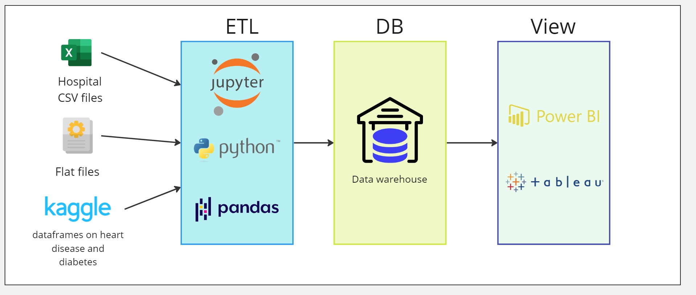

# Detecting Heart Disease & Diabetes with Machine Learning

Machine learning presents an extraordinary opportunity to elevate healthcare standards by enabling early disease detection. By developing precise models for identifying heart disease and diabetes, we can initiate timely interventions, personalized treatment plans, and proactively manage health concerns.

## Data Collection

To begin the process, we collected extensive patient data and outcomes from various medical records and health databases. These datasets, obtained from sources like Kaggle and Google, provided a diverse range of information crucial for training robust machine learning models.

## ETL Process: Extract, Transform, Load

### Extract
Initially, we extracted raw data from the collected sources, encompassing patient demographics, medical history, diagnostic tests, and disease outcomes.

### Transform
The extracted data then underwent rigorous transformation processes. This involved cleaning the data by handling missing values and removing irrelevant information. Additionally, we converted categorical data into numerical format for effective analysis.

### Load
Once transformed, the processed data was loaded into the machine learning pipeline, ready for further processing and model development.

## Data Preprocessing

Following the ETL process, the preprocessed data underwent normalization to ensure uniform data scalability. This step is crucial for preventing certain features from dominating the model training process due to differences in their scales.

## Data Splitting

To evaluate the performance of our models accurately, we split the dataset into training and testing sets. Typically, 70-80% of the data was allocated for training, while the remaining 20-30% was reserved for testing.

## Model Selection

We carefully selected appropriate algorithms, including decision trees and logistic regression, after thorough testing to determine the models that best fit our dataset. Various parameters were fine-tuned to enhance model performance.

## Disease Detection

Utilizing the trained models, we implemented disease detection algorithms capable of accurately identifying heart diseases or diabetes based on new patient data.

## Main Causes of Heart Disease & Diabetes

Understanding the primary risk factors for heart disease and diabetes is crucial for effective prevention and management:

- **High Blood Pressure:** Elevated blood pressure increases the strain on the heart and blood vessels, significantly raising the risk of coronary artery disease and heart attacks.
  
- **High Cholesterol:** Elevated levels of LDL cholesterol can lead to the buildup of plaque in the arteries, narrowing blood flow and increasing the risk of heart disease.
  
- **Obesity:** Obesity contributes to diabetes by promoting insulin resistance, where cells become less responsive to insulin signals, leading to elevated blood sugar levels. Over time, the pancreas may struggle to produce enough insulin to compensate, resulting in type 2 diabetes.

## Tools & Environment

We employed the following tools and environment for our machine learning project:

- **Programming Language:** Python
  
- **Libraries:** Pandas, Matplotlib, NumPy, and Scikit Learn

- **Integrated Development Environments (IDEs):**
  - Visual Studio Code
  - Jupyter Notebook

Jupyter Notebook played a significant role in our project, facilitating exploratory data analysis, model development, and documentation in an interactive and collaborative environment. Its ability to integrate code, visualizations, and explanatory text in a single document streamlined our workflow and enhanced the reproducibility of our analyses.

