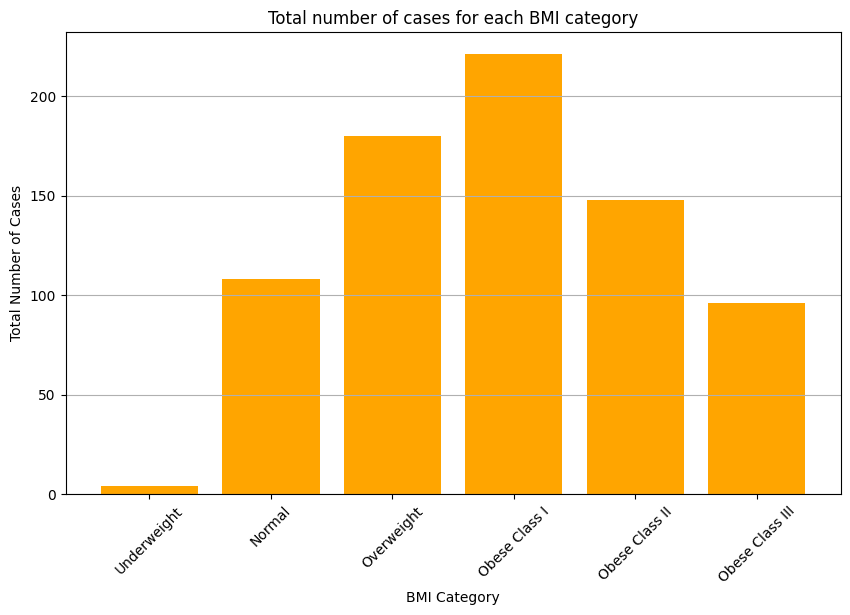

### How to use

1. Clone this repository to your local machine and then go to in it:
```
git clone https://github.com/Sanchez042004/Heart-Diabetes-ML
cd Heart-Diabetes-ML
```
2. Install all the dependencies in the root folder of the project, these are:

```console
pip install pandas
```
```console
pip install matplotlib
```
```console
pip install seaborn
```
```console
pip install scikit-learn
```
```console
pip install numpy
```
```console
pip install xgboost
```

# Heart Disease & Diabetes with Machine Learning
[](https://jupyter.org/)
[](https://www.python.org/)

Machine learning presents an extraordinary opportunity to elevate healthcare standards by enabling early disease detection. By developing precise models for identifying heart disease and diabetes, we can initiate timely interventions, personalized treatment plans, and proactively manage health concerns.

## Data Collection

To begin the process, were collected extensive patient data and outcomes from various medical records and health databases. These datasets, obtained from sources like Kaggle and Google, provided a diverse range of information crucial for training robust machine learning models.

<div style="text-align: center;">
  
</div>

<div style="text-align: center;">
  
</div>

## ETL Process: Extract, Transform, Load

The ETL (Extract, Transform, Load) process is a critical step in preparing data for machine learning and analysis. It begins with extracting raw data from various sources, followed by transforming this data through cleaning and conversion processes to ensure it is suitable for analysis. 

<p class="imagenes" align="center">
  
</p>

### Extract
Then, the raw data was extracted from the collected sources, encompassing patient demographics, medical history, diagnostic tests, and disease outcomes. 

For example this is an extract code for heart disease:
```python
feature_importances = rf_classifier.feature_importances_
feature_importances_df = pd.DataFrame({'Feature': X.columns, 'Importances':feature_importances})
feature_importances_df = feature_importances_df.sort_values(by="Importances", ascending=False)

# Print the ranked list of features by their importances
print("Ranked list of features by importances:")
print(feature_importances_df)
```
### Transform
The extracted data was then subjected to rigorous transformation processes. This involved cleaning the data by handling missing values ​​and removing irrelevant information. Additionally, I converted categorical data to numerical format for effective analysis. 

Subsequently, was used the Matplotlib library to generate graphs and visualizations from the numerical data, allowing for better understanding and analysis of the information.

<p align="center">
  
  
</p>

### Load
Once transformed, the processed data was loaded into the machine learning pipeline, ready for further processing and model development. To perform the loading process, Docker can be used for containers, and the file can be hosted in a database within the container. Additionally, Power BI can be used to visualize the data.


## Data Preprocessing

Following the ETL process, the preprocessed data underwent normalization to ensure uniform data scalability. This step is crucial for preventing certain features from dominating the model training process due to differences in their scales.

## Data Splitting

To evaluate the performance of our models accurately, the dataset was divided into training and testing sets. Typically, 70-80% of the data was allocated for training, while the remaining 20-30% was reserved for testing.

```python
x_train, x_test, y_train, y_test = train_test_split(x,y, test_size=0.2, random_state=42)
```

## Algorithm Selection

### Logistic Regression

I carefully selected appropriate algorithms, including decision trees and logistic regression, after thorough testing to determine the models that best fit our dataset. Various parameters were fine-tuned to enhance model performance.

```python
from sklearn.linear_model import LogisticRegression
logistic_classifier = LogisticRegression()
logistic_classifier.fit(x_train, y_train)
```

### Random Forest

Random Forest is a powerful ensemble learning method that combines multiple decision trees to make predictions. It's highly versatile and widely used in classification and regression tasks due to its robustness and ability to handle large datasets with high dimensionality. 

In this context, Random Forest is employed to predict heart disease based on patient attributes. The model is trained on a dataset comprising various patient features like age, sex, chest pain type, and more. Random Forest utilizes these features to learn patterns and relationships within the data, enabling it to make accurate predictions regarding the presence or absence of heart disease for new patient data.

```python
from sklearn.ensemble import RandomForestClassifier
rf_classifier = RandomForestClassifier()
rf_classifier.fit(x_train, y_train)
```

### Support Vector Machine

This Jupyter notebook outlines an analytical exploration of diabetes prediction using Support Vector Machine (SVM). It initiates by preparing the dataset, extracting relevant features while ensuring data integrity by handling missing values appropriately.

```python
from sklearn.svm import SVC
model = SVC(kernel='linear', C=1.0, random_state=42)
```

### XG Boost and KNN
The notebook then provides an interactive interface for users to input patient-specific health parameters. Leveraging the trained XG Boost or KNN model, the notebook predicts whether the patient is likely to have diabetes based on the input data.

```python
import xgboost as xgb
model = xgb.XGBClassifier(random_state=42)
```

```python
from sklearn.neighbors import KNeighborsClassifier
model = KNeighborsClassifier()
```

## Disease Detection

Using the trained models, disease detection algorithms were implemented capable of accurately identifying heart disease or diabetes based on new patient data.

```markdown
Enter age: 30
Enter sex (M/F): M
Enter chest pain type (ATA/NAP/ASY/TA): NAP
Enter resting blood pressure: 180
Enter cholesterol: 130
Enter fasting blood sugar: 1
Enter resting ECG (Normal/ST/LVH): Normal
Enter max heart rate: 75
Enter exercise angina (N/Y): Y
Enter oldpeak: 1.3
Enter ST Slope (Up/Flat/Down): Down
¡Heart Disease Detected!
```

```markdown
Patient data:
Pregnancies: 3.0
Glucose: 148.0
BloodPressure: 66.0
SkinThickness: 0.0
Insulin: 0.0
BMI: 33.8
DiabetesPedigreeFunction: 0.87
Age: 50
Diabetes Detected
```
## Main Causes of Heart Disease & Diabetes

Understanding the primary risk factors for heart disease and diabetes is crucial for effective prevention and management:

- **High Blood Pressure:** Elevated blood pressure increases the strain on the heart and blood vessels, significantly raising the risk of coronary artery disease and heart attacks.
  
- **High Cholesterol:** Elevated levels of LDL cholesterol can lead to the buildup of plaque in the arteries, narrowing blood flow and increasing the risk of heart disease.
  
- **Obesity:** Obesity contributes to diabetes by promoting insulin resistance, where cells become less responsive to insulin signals, leading to elevated blood sugar levels. Over time, the pancreas may struggle to produce enough insulin to compensate, resulting in type 2 diabetes.

## Tools & Environment

I employed the following tools and environment for our machine learning project:

- **Programming Language:** Python
  
- **Libraries:** Pandas, Matplotlib, NumPy, and Scikit Learn

- **Integrated Development Environments (IDEs):**
  - Visual Studio Code
  - Jupyter Notebook
